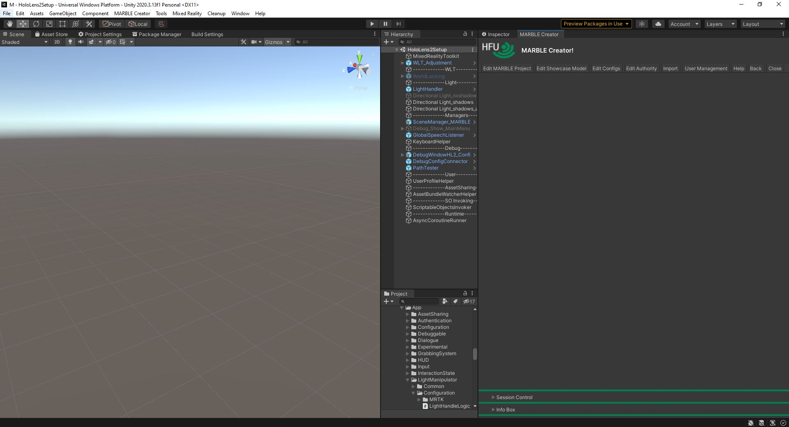
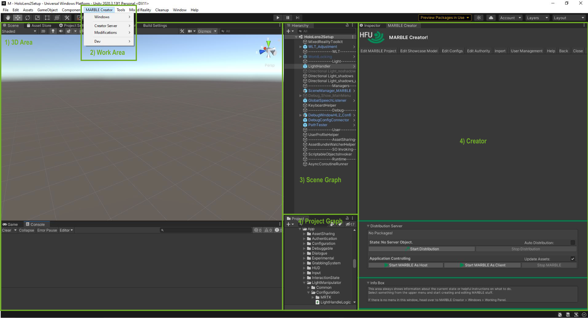
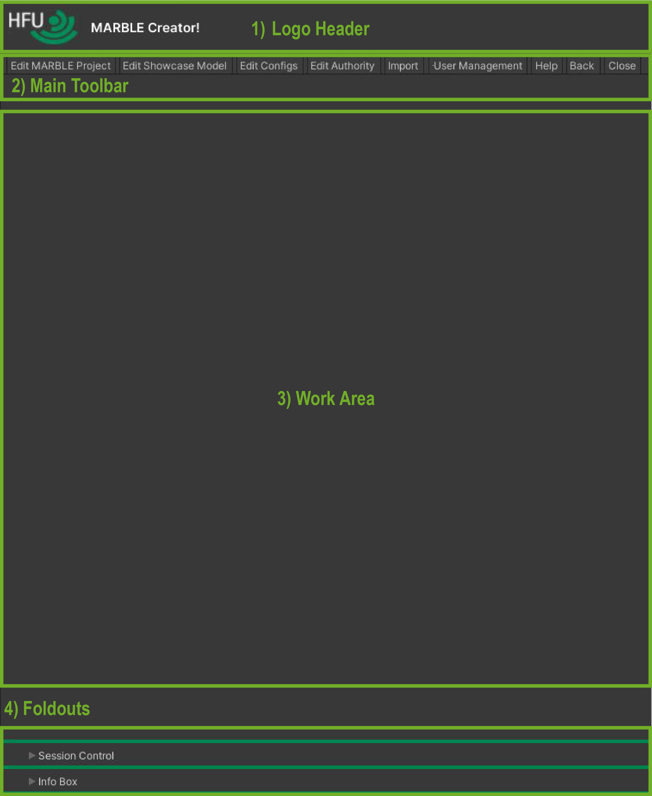
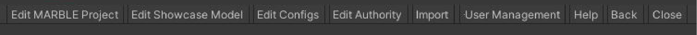
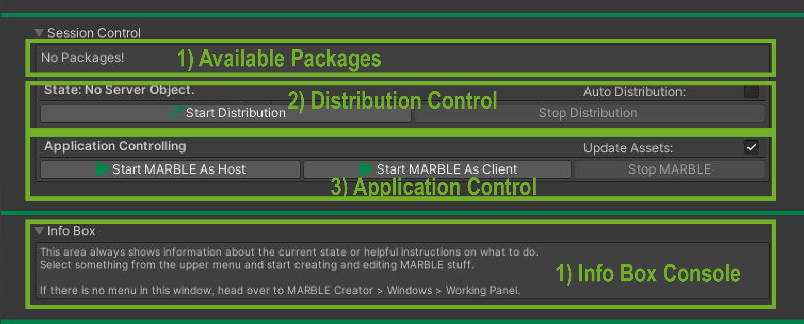

# Unity and Creator Overview
The following image shows Unity and the Creator Plugin.

# Unity Editor Areas
1. 3D Area --> Shows the current scene. Will display the model when opening "Edit Showcase Model".
2. Creator Menu Item --> Menu navigation to open Creator and its features.
3. Scene Graph --> All elements in the scene. Or model components when "Edit Showcase Model" is open.
4. Project Graph --> Folders of the Unity Project.
5. Creator --> The actual MARBLE Creator plugin window.

# Creator Window
The Creator Window is separated into:
1. Logo Header --> Just the header and the creator link.
2. Main Toolbar --> Main navigation area. From here you can reach every feature.
3. Work Area --> In this area functions as the main display for all features and settings of the creator.
4. Foldouts --> The two foldouts are a integrated version of the session control and the info box.

# Creator Main Menu Toolbar
Consists of:
* Edit MARBLE Project --> Create, Edit and Delete MARBLE Projects.
* Edit Showcase Model --> Create, Edit, Link and Delete MARBLE Models.
* Edit Configs --> Edit config files to configure the MARBLE session (see [Configs & Effects](https://github.com/FUSEEProjectTeam/MARBLE/wiki/Configs-And-Effects)).
* Edit Authority --> Edit what user is allowed to do what.
* Import --> Controls to import model files to unity to use them in a MARBLE Project.
* User Management --> Controls to create, edit and delete user profiles. It also displays the login area. Currently experimental.
* Help --> Area for more infos and Info Box controls
* Back --> Open last Creator window
* Close --> Close currently opened Creator window

# Creator Foldouts
The Foldouts offer the following areas:
Session Control:
1. Available Packages --> The exported packages which can be distrbuted. The selected package will be distributed in the session.
2. Distribution Control --> Displays the distribution server state and gives the controls to start and stop the distribution.
3. Application Control --> Starts MARBLE either in Host-Mode or in Client-Mode. 

Info Box:
1. Info Box Console --> All infos during the editing in the Creator are displayed here. It filters only the necessary infos for the Creator usage.

