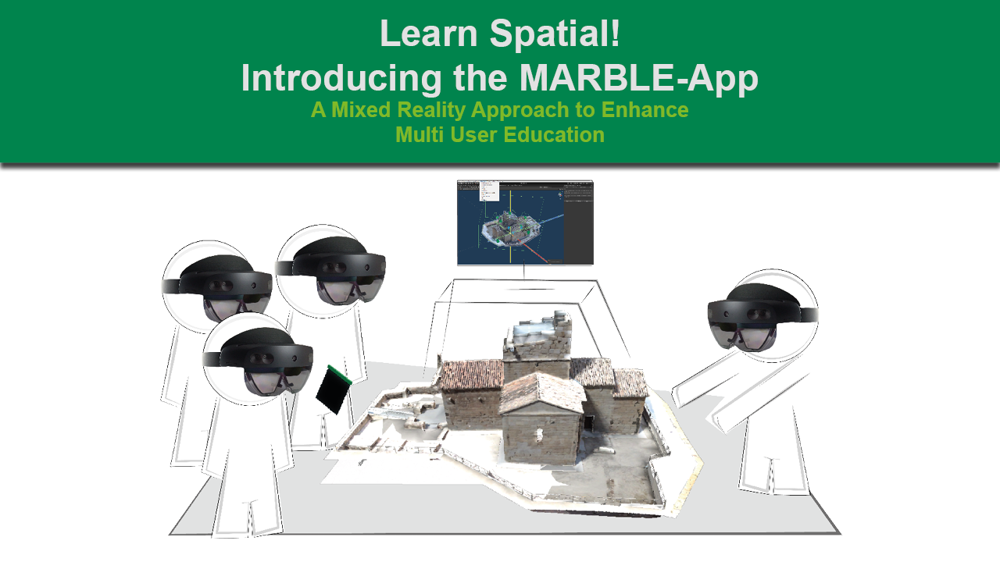
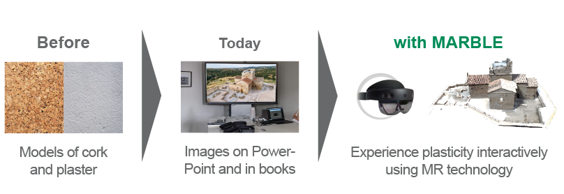

<h1> Introducting MARBLE </h1> 
MARBLE is an interactive multi user presentation plattform for displaying architecture on the HoloLens2. With MARBLE one can create content packages (seminars) and display them on multiple HL2 devices. MARBLE displays the 3D content for everybody at the same position with the same orientation to enable a shared learning experience.
Additional MARBLE is packed with "tools" to interact with the presented 3D model, like pointers or clipping planes.

<h1> MARBLE Background </h1>
MARBLE is a cooperative project between the Albert-Ludwigs-University Freiburg and Furtwangen University. It explores the possibility of enriching archaeological higher education using mixed reality technology. It is based on the idea of offering students the opportunity to perceive and examine excavations and artefacts in three dimensions without having to travel to excavations.
Instead of having to continue working with two-dimensional sources such as photographs or videos, MARBLE offers a shared three-dimensional interactive experience for a whole group of students.

<h1> Interested? What´s Next?</h1>

* [Read the IEEE ISMAR Paper ](https://ieeexplore.ieee.org/document/9974285)
* [Watch the videos ](https://www.youtube.com/playlist?list=PLnLsJCpSmHCUUHcXpfS0quV_wdfkYei4v)
* [Get Access](mailto:marc-alexander.lohfink@hfu.eu)
* [Install MARBLE](Install-&-Setup)
* [Get Started](Getting-Started)