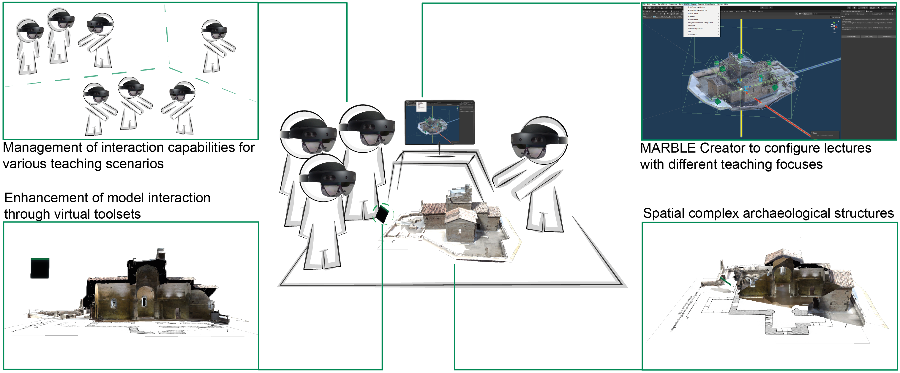
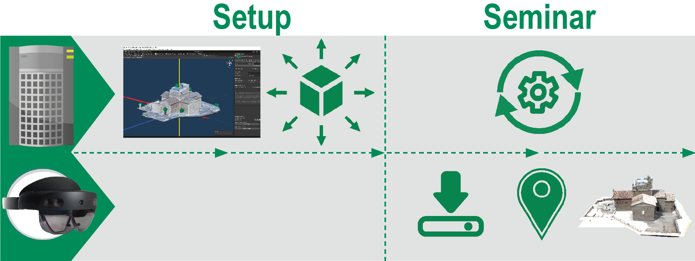

# A Mixed Reality Approach to Enhance Archaeological Higher Education
The concept behind MARBLE is to offer a Mixed Reality platform for non-tech-savvy teaching stuff and students. In general, the MARBLE-App consists of two parts. One part is the MARBLE Creator, which is implemented as a Unity Editor integration for teachers and serves as a tool for preparing MARBLE sessions. The other part is the MARBLE Player, the presentation tool that runs on the Microsoft's HoloLens2 (HL2) and displays the main model prepared with the Creator. Like the Creator, the Player is also developed with Unity.
The overview image shows the main concept and features of MARBLE

As it is known that AR can create cognitive overload on students, which can negatively affect educational effectiveness [1], the development of the MARBLE-App is subject to the paradigms of user-friendliness and the reduction of setup effort to a minimum for a non-tech-savvy target group. The students should be able to dive straight into the course without having to laboriously set up the Player each time.
The following picture illustrates the base interaction between the Creator and the Player. The Creator on the top row is for preparing and setting up the following seminar, in which the Creator synchronizes all clients. The Player first requests the current seminar, locates its spatial position, and then displays the seminar's model. 

If you are further interested in the concept behind MARBLE, read the [IEEE ISMAR Paper ](https://ieeexplore.ieee.org/document/9974285).

# Publications & Further Announcements
MARBLE was already presented on a couple of conferences & announced in some articles:
* [IEEE ISMAR 2022](https://ieeexplore.ieee.org/document/9974285)
* [First Announcement HFU](https://www.hs-furtwangen.de/forschung/forschungsprojekte/marble/)
* [HFU Blog](https://www.hs-furtwangen.de/aktuelles/detail/3177-per-brille-in-den-untergrund/)

And the publications from our cooperative partners:
* [Uni Freiburg](https://www.byzanz.uni-freiburg.de/Forschung/marble)
* [EPICUR](https://www.academia.edu/57162894/MARBLE_Mixed_and_Augmented_Reality_in_Blended_Learning_Environments)
* [Research Blog](https://uni-freiburg.de/lehre/e-teaching-fellowships-des-projekts-4d/)

# What´s Next?
* [Read the IEEE ISMAR Paper ](https://ieeexplore.ieee.org/document/9974285)
* [Watch the videos ](https://www.youtube.com/playlist?list=PLnLsJCpSmHCUUHcXpfS0quV_wdfkYei4v)
* [Get Access](mailto:marc-alexander.lohfink@hfu.eu)
* <a href="Install-&-Setup.md">Install MARBLE</a>
* <a href="Install-&-Setup.md">Get Started</a>

# Sources
[1] M. Akçayır and G. Akçayir. Advantages and challenges associated with augmented reality for education: A systematic review of the literature. Educational Research Review, 20:1–11, 2017. doi: 10.1016/j.edurev.2016.11.002