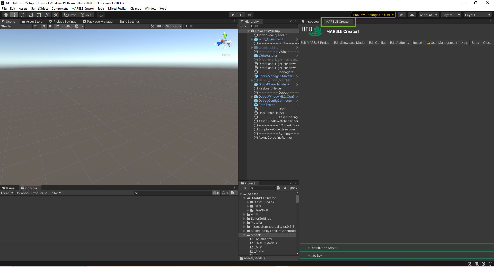
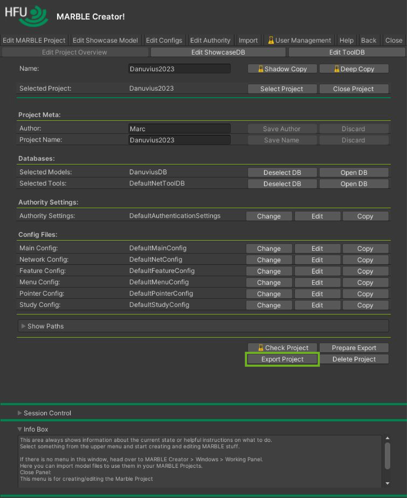
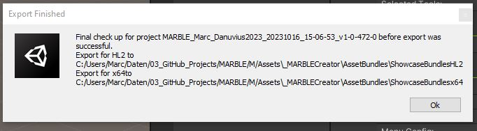
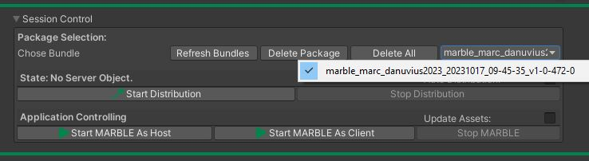
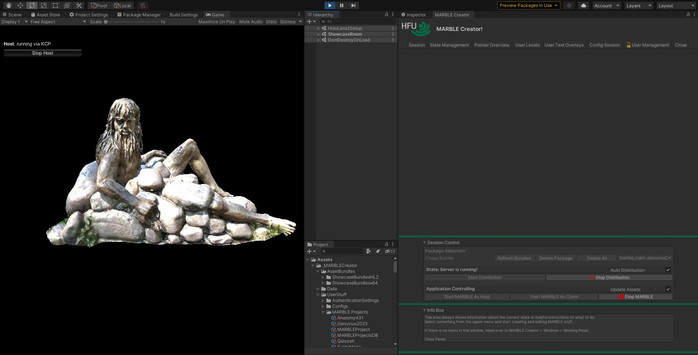
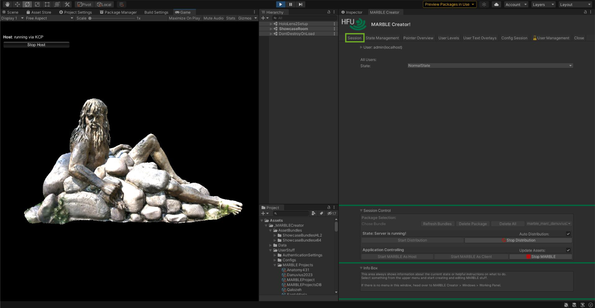
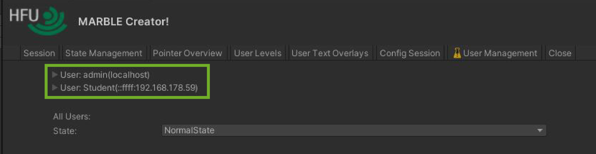

First of all make sure that you have installed MARBLE as stated in <a href="Install-&-Setup">Install & Setup</a>.

# Open MARBLE Creator

If the Creator panel does not pop up automatically call it from the top menu.
The figure illustrates that you can find the Creator panel under "MARBLE Creator > Windows > Creator":

As the Creator panel is a simple unity panel you can dock it as any other panel.
See the next figure:

# Create A Project
MARBLE is based on MARBLE Projects. Those are data structures which contain and reference all important data for your session. In order to use MARBLE synchronized on the HoloLense2 devices you need at least one MARBLE Project which you distribute as package (see <a href="Concept-&-Architecture#asset-bundles-and-updates">_Concept & Architecture - AssetBundles And Updates_</a>).
To create a MARBLE Project enter a unique name and click "Create New Project". For more information read <a href="MARBLE-Projects">MARBLE Projects</a>.

# Fill The Project
In order to use your imported models you have to create a new model database and also reference all the necessary configs and settings. Read <a href="MARBLE-Projects#select-configs">MARBLE Projects - Select Configs</a> and <a href="Edit-Showcase-Models">Edit Showcase Models</a>. For the sake of this tutorial reference the "Selected Tools:" and the "Authority Settings:" with the default references starting with the prefix "Default".

# Export Project
After finishing all the steps at <a href="MARBLE-Projects">MARBLE Projects</a> you can export the project into a package by pressing the "Export Project" button in the work area.

When finished Unity will show you the following prompt indicating that the export has finished.

# Distribute Project
After the project has been successfully exported, it can be selected for distribution in the Session Control window. Select it from the dropdown at "Package Selection:" > "Chose Bundle:". The name of the bundle is always _"marble\_*author name*\_*project name*\_*creation date*\_*creation time*\_*build version*_.
For more information read <a href="Concept-&-Architecture#asset-bundles-and-updates">_Concept & Architecture - AssetBundles And Updates_</a>.

# Run Session
Make sure that "Auto Distribution" is enabled or the distribution server is started with the right package and that "Update Assets" is selected.
Then click "Start MARBLE As Host".

After successfully started the distribution and the session you should see something like in the following image. Clients are now able to join.

# Clients Connect
Now clients will download the asset package with your configured session/ seminar. Head over to "Session" > "User Overview" to see all connected clients.

First there will only be the "User: admin". This is the host client on the server which serves as an controlling instance. When a client connects it will appear in the overview. 

# Whats Next?
Now you are free to investigate the model.
* <a href="Creator-Overview">Get an overview of the Creator</a>
* <a href="Import-Models">Read about importing models</a>
* <a href="MARBLE-Projects">Create a MARBLE Project</a>